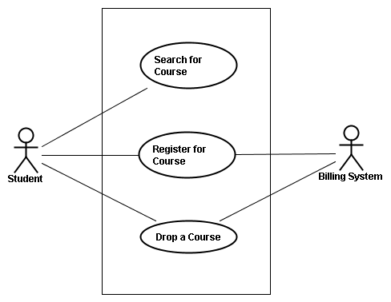

# Lab 4 Requirements Specification and UML Use Cases
In this lab, we will practice gathering requirements from a text description. We will design use cases and write out use case descriptions. You can answer the lab assignment by yourself or in a group of 2 (**preferred**).  Your Use case diagram can by uploaded as a PDF (preferred), or other graphic format (png, jpg, etc).   For the descriptions, please develop them using GitHub markdown (in a `.md` file). 

## UML Use Case
UML [Unified Modeling Language](https://en.wikipedia.org/wiki/Unified_Modeling_Language) is a standardized graphical language used for visualizing, specifying, constructing, and documenting the artifacts of software systems, as well as for modeling business processes and data structures.  It includes components for modelling behaviours as well as the structure of a system.


[src: Microsoft](https://support.microsoft.com/en-us/office/uml-diagrams-in-visio-ca4e3ae9-d413-4c94-8a7a-38dac30cbed6)

A [**Use Case**](https://en.wikipedia.org/wiki/Use_case) diagram is a type of behavioural UML diagram used to capture the **functional requirements**(what the system should do, in non-technical language) of a system. The purpose of a use case diagram is to provide a high-level view of the system's capabilities and to identify the main actors and their relationships to the system, as well as the various use cases that the system must support. Use case diagrams help to clarify the system's requirements and facilitate communication between stakeholders before starting to work on the development of code.  In the use case diagram, each bubble represents a single scenario (see image).   Actors appear outside the box which represents the system and can interact with one (or more scenarios).



Typically, the Use Case diagram will be accompanied with descriptive text describing the flow of each use case, including a description of **what** the use case is for/does, the primary actor(s), things that need to be in place before the specific use case can occur (pre-conditions), what will happen during the use case (main steps or actions), and what will be the result of the use case running (post-conditions).  Use cases will also describe how to handle errors or flows under different conditions (extensions).  There are a number of different views and approached to developing usable use case diagrams such as the brief, casual, outline, all the way to what is called a fully dressed.  [Alistair Cockburn](https://en.wikipedia.org/wiki/Alistair_Cockburn) proposed the [fully dressed](https://en.wikipedia.org/wiki/Use_case#Fully_dressed) use case that provides a detailed description including stakeholders, guarantees, and triggers but recognizes that many projects don't need that level of detail and can be modified to suit the needs of the project.   A number of different views exist such as [Martin Folwer's](https://en.wikipedia.org/wiki/Martin_Fowler_(software_engineer)) approach to treating the use-case as a user story which is a simplification of the Cockburn template.  

## Tools for Developing Use Case Diagrams

There are a number of tools that are available to develop the visual case diagram which will give us the high-level representation of our system requirements.  A tool that you can use is Visio (from Microsoft) which provides the option to build a number of different [UML diagrams]() and specifically [use case diagrams](https://support.microsoft.com/en-us/office/create-a-uml-use-case-diagram-92cc948d-fc74-466c-9457-e82d62ee1298).

Other online tools can also be used (at a free tier level) such as:

- [Lucid Chart](https://www.lucidchart.com/pages/uml-use-case-diagram)
- [Visual Paradigm](https://online.visual-paradigm.com/diagrams/solutions/free-use-case-diagram-tool/)
- [Figma](https://www.figma.com/templates/use-case-template/)

You are welcome to use any tool that you wish, as long as the format is correct and that you submit a file that can be readily viewed **without** having to install/use a specific application (i.e. save your diagram as a PDF, png, etc) but do remember to also save your source in case you need to go back and make changes!  

## The General Structure of a Use Case

In our lab, we are going to consider a variant of the Cockburn template that will include the following for each use-cae
```
    Use Case <id>. <use case name>
    Primary actor:
    Description:
    Pre-condition:
    Post-condition:

    Main scenario:
        - List of 3-9 steps describing common interaction scenario

    Extensions:
        - Flow of control or error handling different from main scenario
```

When developing use case's consider the following items:
- Make sure to always use a verb as the first word in your use case (as a use case represents an *action* or *interaction* the actor(s) will do with the system.
- Two use cases should NEVER be connected together with an association link (only can connect use cases if using include or extend, or with inheritance).

## Warm Up

The following in an example for you to work through, but doesn't need to be submitted.  It is to help you better understand the process of developing a use case diagram **before** doing the assignment.  

Consider what a use case diagram for an ATM system would look like. The ATM should support standard features like deposit, withdraw, transfer, and checking account balances. It should support checking and savings accounts. You can assume that the ATM is owned by the bank, so the ATM system communicates with the bank's internal account system when required. That is, you do not worry about how ATMs not owned by the bank get information from another bank's systems.  Sketch out what you think the use case diagram would look like and then work through detailing what will be involved in each use case (using the structure introduced previously). When are done,  compare it with the [use case diagram](warmup/A3warmup_UseCaseDiagram.png).  A slightly [more complicated](warmup/A3warmup_UseCaseDiagram2.png) example can also consider conditions for validating the PIN as well as using the `include` to utilize a common account component.  Review and compare your use case descriptions with the [use case descriptions](warmup/A3warmup_UseCaseDesc.txt) for the second example (which should be similar to what you developed).  The key takeaway with this warm-up to to understand the structure and format of the diagrams and descriptions.

## The Lab Assignment (30 marks)

### Problem Statement:
Your **customer** wants a software system for a simple electronic bookstore called EBook. EBook does not store any books itself. It just provides a large catalogue of the books it offers. The catalogue contains for each book the usual information like ISBN-number, title, authors, publisher, price, etc. A customer can order a book over the Internet and pay by credit card. Otherwise, they can phone in or mail their order to the company where **clerks** will enter the order for them. Both customers and clerks can search the catalog online, and enter and view comments for any book in the catalog. When processing a customer order, the payment is verified first, and if accepted, then the book is ordered directly from the **publisher** by direct communication with their system. The book is shipped from the publisher to our store, then it is sent to the customer. A customer can order several books per order, and they will get shipped to the customer as they arrive at EBook, i.e. a single order can result in several shippings to the customer. Customers and clerks can inquire about the status of an order any time.

Of course, the catalogue needs some maintenance, so the clerks can add and delete items from the catalogue, as well as update information. Clerks are able to inquire how many books are pending from a specific publisher.

*Cancellation:* A customer can cancel an order as long as it has not yet been sent out to him. In case of a cancellation, EBook either sends a cancel order instruction to the publishers or returns the book(s) to them.

*Return of books:* A customer can return a book within a week. The money will either be credited to his credit card, or the customer receives a refund check.

### Questions:
1. Develop a use case model for this problem (this will be your diagram, making sure to use the correct format and connect the actors appropriately)(**Hint**: there are three actors that need to be considered in this system). List the actors and describe them (in the `.md` file). (15 marks)
2. Name and prioritize each use case. (3 marks)
3. Provide a detailed description for each use case containing sections for use case id and name, primary actor, description, pre- and post-conditions, step-by-step description of primary scenario (numbered list of steps), and secondary/extension scenarios. You are free how you document the secondary scenario (deltas to basic flow of events, within description of basic flow of events, separate description), but be consistent and choose a reasonable level of detail. Use the format presented for use case description as given in the lab introduction (**Hint:**: look at your warmup work to review that format required). (10 marks)
4. List and prioritize at least 2 development risks for this system. (1 mark)
5. List at least 2 high-level requirements not captured in the use case model. e.g. timing requirements (1 mark)

## Submission:
 Answer all questions in an `.md` file and ensure that your use case diagram is added to your repo. Please commit your work to your repo and ensure that it is pushed back upstream to the GitHub Classroom. Please submit the link to your repo in the assignment for this lab on Moodle.
